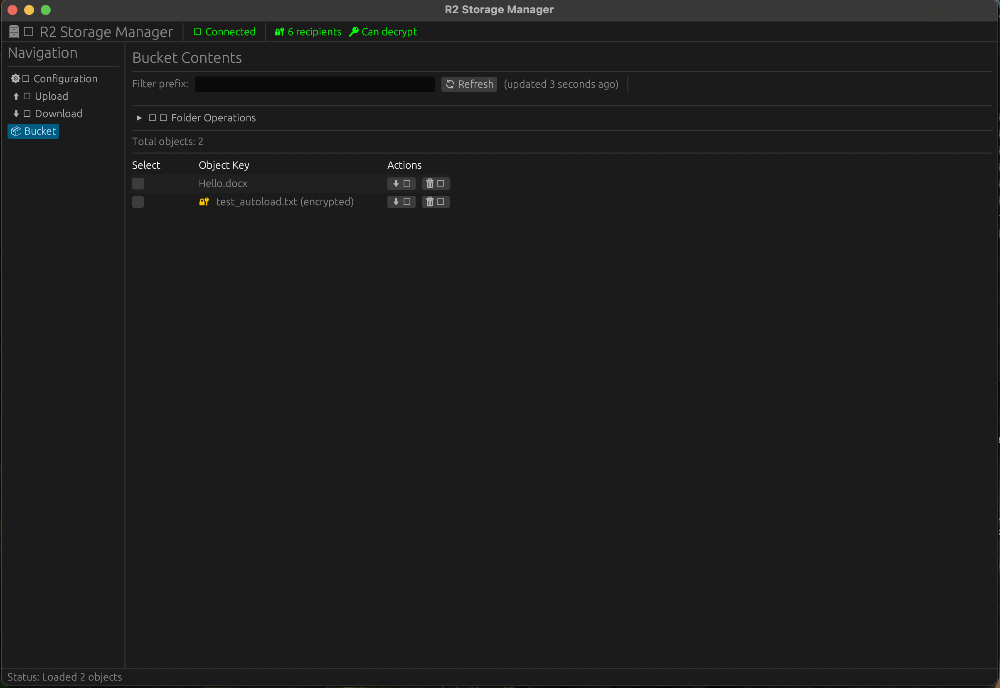

# rust-r2

[](LICENSE)
[](https://github.com/SilentHeroes/rust-r2/actions)
[](https://github.com/SilentHeroes/rust-r2/releases)

Enterprise Cloudflare R2 client with PGP encryption support. Native desktop GUI and CLI tools.

**[How-To Guide](docs/HOW-TO.md)** | **[Technical Docs](docs/TECHNICAL.md)** | **[Encryption](docs/ENCRYPTION.md)** | **[Configuration](docs/CONFIGURATION.md)** | **[CLI Reference](docs/CLI_REFERENCE.md)**



## Installation

### Binary Releases

Download platform-specific binaries from [Releases](https://github.com/SilentHeroes/rust-r2/releases).

**macOS**: `xattr -cr rust-r2-*` (bypass Gatekeeper)  
**Windows**: Properties → Unblock or "More info" → "Run anyway"  
**Linux**: `chmod +x rust-r2-*`

### Build from Source

```bash
git clone https://github.com/SilentHeroes/rust-r2.git
cd rust-r2/rust-r2
cargo build --release
```

## Configuration

Create `config.json`:

```json
{
  "r2": {
    "access_key_id": "your_key",
    "secret_access_key": "your_secret",
    "account_id": "your_account_id",
    "bucket_name": "your_bucket"
  },
  "pgp": {
    "team_keys": ["keyring.asc"]
  }
}
```

## Usage

### GUI
```bash
./rust-r2-gui
```

### CLI
```bash
# List objects
./rust-r2-cli list

# Upload with encryption
./rust-r2-cli upload file.txt remote/path.txt --encrypt

# Download and decrypt
./rust-r2-cli download remote/path.txt.pgp local.txt --decrypt

# Auto-loads config.json from current directory
# Or specify: --config /path/to/config.json
```

## Features

- **End-to-End Encryption**: OpenPGP (RSA 2048/4096)
- **Auto-Configuration**: Detects `config.json` in working directory
- **Batch Operations**: Multi-file upload/download with progress tracking
- **Team Collaboration**: Multi-recipient encryption via keyrings
- **Native Performance**: Built in Rust with async I/O

## Architecture

```
┌─────────────┐     ┌──────────┐     ┌────────────┐
│   GUI/CLI   │────▶│  R2 API  │────▶│ Cloudflare │
└─────────────┘     └──────────┘     └────────────┘
       │                  │
       ▼                  ▼
┌─────────────┐     ┌──────────┐
│ PGP Handler │     │  Config  │
└─────────────┘     └──────────┘
```

## Dependencies

**macOS**: None (self-contained)  
**Windows**: Visual C++ Redistributables (usually pre-installed)  
**Linux**: `libgtk-3-0 libssl1.1` (GUI only)

## Documentation

- **[How-To Guide](docs/HOW-TO.md)** - Complete usage guide with examples
- **[Technical Docs](docs/TECHNICAL.md)** - Architecture and implementation details
- **[Configuration](docs/CONFIGURATION.md)** - Detailed configuration options
- **[CLI Reference](docs/CLI_REFERENCE.md)** - Command-line interface reference
- **[Encryption](docs/ENCRYPTION.md)** - PGP encryption implementation

## Security

- TLS 1.2+ enforced
- AWS Signature V4 authentication
- Local-only key storage
- Zero-knowledge encryption

## License

MIT - See [LICENSE](LICENSE)

## Support

[Issues](https://github.com/SilentHeroes/rust-r2/issues) | [Releases](https://github.com/SilentHeroes/rust-r2/releases)