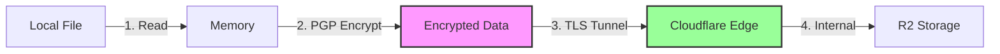

# Encryption & Security

## Overview

Rust R2 provides end-to-end encryption for your files using industry-standard OpenPGP encryption, ensuring your data remains secure both in transit and at rest.

## Security Features

### 🔐 OpenPGP Encryption
- **Standard**: OpenPGP (RFC 4880) compliant encryption
- **Library**: Uses the [`pgp`](https://crates.io/crates/pgp) Rust crate
- **Algorithm**: RSA with configurable key sizes (2048-bit default, 4096-bit recommended)
- **Armor Format**: Base64 ASCII-armored output for text compatibility

### 🛡️ Transport Security
- **HTTPS Only**: All connections to Cloudflare R2 use TLS 1.2+
- **Certificate Validation**: Full SSL/TLS certificate verification
- **No Downgrade**: Enforces HTTPS, no fallback to HTTP
- **API Security**: Uses AWS Signature Version 4 for request signing

### 🔑 Key Management
- **Local Keys**: PGP keys stored locally, never transmitted
- **Passphrase Support**: Optional passphrase protection for private keys
- **Key Separation**: Public keys for encryption, private keys for decryption
- **No Key Storage**: Keys are never uploaded to R2 or any remote service

## How It Works

### Encryption Process (Upload)
```
1. File Selected → 2. Read into Memory → 3. PGP Encryption (if enabled)
   ↓
4. Encrypted Data → 5. HTTPS Upload → 6. Stored in R2 (encrypted)
```

### Decryption Process (Download)
```
1. Download from R2 → 2. Receive Encrypted Data → 3. PGP Decryption (if enabled)
   ↓
4. Original File → 5. Save to Disk
```

## Technical Details

### Encryption Implementation

The application uses the `pgp` crate which implements:
- **Public Key Encryption**: RSA encryption with PKCS#1 v1.5 padding
- **Symmetric Encryption**: AES-256 for actual data encryption
- **Hybrid Approach**: RSA encrypts the AES session key, AES encrypts the data
- **Compression**: Optional compression before encryption (ZLIB)

### Wire Security

#### TLS/HTTPS Protection
All data transmitted between your machine and Cloudflare R2 is protected by:
- **TLS 1.2/1.3**: Modern TLS protocols only
- **Strong Ciphers**: AES-256-GCM, ChaCha20-Poly1305
- **Perfect Forward Secrecy**: Ephemeral key exchange (ECDHE)
- **Certificate Pinning**: Validates Cloudflare certificates

#### Request Authentication
- **AWS SigV4**: Cryptographic signing of all API requests
- **HMAC-SHA256**: Request integrity verification
- **Time-based**: Requests expire after 15 minutes
- **Anti-replay**: Timestamp prevents request replay attacks

### Data Flow Security



## Security Best Practices

### Key Generation
```bash
# Generate strong 4096-bit RSA keys
gpg --full-generate-key
# Select: (1) RSA and RSA
# Keysize: 4096
# Expiry: 1y (rotate annually)
```

### Key Storage
- Store keys on encrypted disk/partition
- Use hardware security modules (HSM) for production
- Backup keys to secure offline storage
- Never commit keys to version control

### Configuration Security
```bash
# Set restrictive permissions
chmod 600 config.json
chmod 600 *.key

# Use environment variables instead of files
export R2_ACCESS_KEY_ID="..."
export R2_SECRET_ACCESS_KEY="..."
```

## Threat Model

### Protected Against

✅ **Data Interception**: TLS prevents eavesdropping
✅ **Data at Rest**: PGP encryption protects stored files
✅ **Man-in-the-Middle**: Certificate validation prevents MITM
✅ **API Tampering**: Request signing ensures integrity
✅ **Unauthorized Access**: API keys required for all operations

### Not Protected Against

❌ **Compromised Endpoint**: If your machine is compromised
❌ **Weak Keys**: Using keys smaller than 2048-bit
❌ **Key Theft**: If private keys are stolen
❌ **Metadata**: File names and sizes are not encrypted
❌ **Traffic Analysis**: Connection patterns are visible

## Compliance & Standards

### Standards Compliance
- **OpenPGP**: RFC 4880 compliant
- **TLS**: RFC 8446 (TLS 1.3)
- **AWS SigV4**: AWS Signature Version 4
- **FIPS 140-2**: Cryptographic modules (when using compliant OpenSSL)

### Suitable For
- GDPR data protection requirements
- HIPAA technical safeguards (with proper configuration)
- PCI DSS data encryption requirements
- SOC 2 Type II controls

## Performance Impact

### Encryption Overhead
- **CPU**: ~10-20MB/s on modern hardware
- **Size**: ~40% increase due to Base64 armor encoding
- **Memory**: Files loaded entirely into memory
- **Time**: Linear with file size

### Optimization Tips
- Use encryption selectively for sensitive data
- Consider binary format (non-armored) for large files
- Batch operations to amortize connection overhead
- Use connection pooling for multiple operations

## Libraries & Dependencies

### Core Cryptographic Libraries
- [`pgp`](https://crates.io/crates/pgp) - OpenPGP implementation
- [`rustls`](https://crates.io/crates/rustls) - Modern TLS implementation
- [`ring`](https://crates.io/crates/ring) - Cryptographic primitives
- [`sha2`](https://crates.io/crates/sha2) - SHA-256 for signatures

### Security Audit
- All cryptographic operations use well-vetted libraries
- No custom cryptographic implementations
- Regular dependency updates via `cargo audit`

## FAQ

### Q: Is my data encrypted in R2?
**A:** If you enable encryption during upload, yes. The data is encrypted locally before upload and remains encrypted in R2.

### Q: Can Cloudflare see my encrypted data?
**A:** No. Files are encrypted on your machine using your PGP public key. Only someone with the corresponding private key can decrypt them.

### Q: Is HTTPS enough without PGP encryption?
**A:** HTTPS protects data in transit but not at rest. For sensitive data, use both HTTPS (automatic) and PGP encryption (optional).

### Q: What happens if I lose my private key?
**A:** Encrypted files become permanently inaccessible. Always maintain secure backups of your private keys.

### Q: Can I use different keys for different files?
**A:** Currently, the application uses one key pair per configuration. You can use different configurations for different key pairs.

## Additional Resources

- [OpenPGP Standard (RFC 4880)](https://tools.ietf.org/html/rfc4880)
- [Cloudflare R2 Security](https://developers.cloudflare.com/r2/reference/security/)
- [AWS Signature Version 4](https://docs.aws.amazon.com/general/latest/gr/signature-version-4.html)
- [TLS Best Practices](https://wiki.mozilla.org/Security/Server_Side_TLS)
- [GPG Best Practices](https://riseup.net/en/security/message-security/openpgp/best-practices)